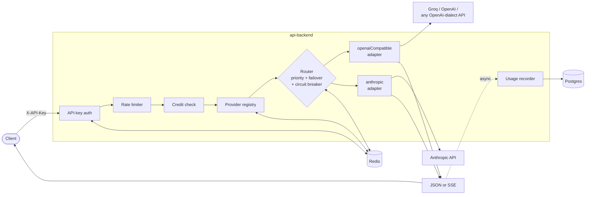
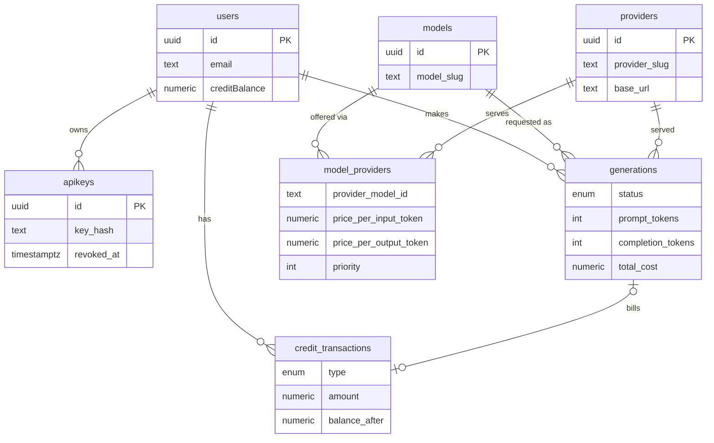

<div align="center">

# OpenRouter (self-hosted)

**A unified interface for LLMs — self-hosted.**

One API, one key, every model. Point your app at this gateway instead of wiring up each provider — it routes every request to the best available provider, fails over automatically, streams the response, and meters usage against a credit balance with a full audit trail.


</div>

---

## Table of contents

- [Demo](#demo)
- [Features](#features)
- [How it works](#how-it-works)
  - [Request flow](#request-flow)
  - [Data model](#data-model)
  - [Monorepo layout](#monorepo-layout)
- [Quickstart](#quickstart)
- [API overview](#api-overview)
- [Configuration](#configuration)
- [Status & roadmap](#status--roadmap)
- [Testing](#testing)
- [Troubleshooting](#troubleshooting)
- [Acknowledgements](#acknowledgements)
- [Contributing](#contributing)

---

## Demo

A real streaming session against the gateway (Groq serving Llama 3.3 70B):

```console
$ curl -N http://localhost:3001/chat/completions \
    -H "X-API-Key: sk_..." -H "Content-Type: application/json" \
    -d '{"model":"llama-3.3-70b",
         "messages":[{"role":"user","content":"Count from 1 to 5, digits only."}],
         "options":{"stream":true}}'

data: {"content":"1"}
data: {"content":"\n"}
data: {"content":"2"}
...
data: {"content":"5"}
data: {"usage":{"prompt_tokens":46,"completion_tokens":10},"finish_reason":"stop"}
data: [DONE]
```

Every request lands in the usage log and the credit ledger:

```console
$ curl -s http://localhost:3000/users/me/generations --cookie "token=..."
{"generations":[{"model":"llama-3.3-70b","provider":"groq","status":"success",
  "prompt_tokens":46,"completion_tokens":10,"total_cost":"0.00003504","latency_ms":225, ...}]}

$ curl -s http://localhost:3000/users/me/transactions --cookie "token=..."
{"transactions":[{"type":"usage","amount":"-0.000035","balance_after":"9.999937", ...}]}
```

## Features

- **Unified API** — one endpoint, one key, any model behind it. Swap providers without touching client code.
- **Provider routing with failover** — back one model with several providers, each with its own pricing, context window, and upstream model id. Requests walk providers by priority; 429/5xx/network failures fail over to the next, and a Redis-backed **circuit breaker** puts flapping providers on a 30-second cooldown.
- **Streaming** — SSE end to end, token usage on the final chunk. Failover still works until the first byte reaches the client.
- **Usage-based billing** — per-token pricing per provider. Every request writes a `generations` row (tokens, cost, latency, serving provider) and an append-only credit-ledger entry with `balance_after`. New accounts start with **10 free credits**, recorded as a `bonus` ledger entry.
- **Admin surface** — CRUD for providers, models, and routes (prices, priority, context limits) plus a manual credit on-ramp. Every mutation invalidates the relevant caches, so changes apply instantly.
- **Accounts & API keys** — email-verified sign-up, JWT cookie sessions, password reset, API keys hashed at rest with instant revocation.

## How it works

### Request flow



The registry resolves a model slug to its active providers in one cached, joined query. The router walks them in priority order — retryable failures (429, 5xx, network) move to the next provider; client errors (4xx) fail fast because no provider can fix a bad request. Billing runs after the response so users never wait on it. Adding an OpenAI-compatible provider requires **zero code**: a DB row, an env var, and a route.

### Data model



`model_providers` is the heart of it — the junction that makes multi-provider routing and per-provider pricing possible. `generations` is the usage log everything else derives from; `credit_transactions` is the append-only ledger (a `payments` table exists in the schema, reserved for a future payment-provider integration). Full schema: [`packages/db/src/schema.ts`](packages/db/src/schema.ts).

### Monorepo layout

Managed with [Turborepo](https://turborepo.dev/) + [Bun](https://bun.sh/) workspaces.

```
apps/
  primary-backend/    accounts, API keys, catalog, dashboard APIs, admin   :3000
  api-backend/        the inference gateway — /chat/completions            :3001
  web/                Next.js dashboard (scaffold, not built out yet)

packages/
  db/                 Drizzle schema + Postgres client        @repo/db
  cache/              Redis client + BullMQ email queue/worker @repo/redis
  ui/                 shared React components
  eslint-config/      shared ESLint config
  typescript-config/  shared tsconfig bases
```

## Quickstart

**Prerequisites**

| Requirement | Notes |
| --- | --- |
| [Bun](https://bun.sh/) ≥ 1.3 | runtime + package manager |
| PostgreSQL | any instance — [Neon](https://neon.tech/) works great |
| Redis | any instance |
| Provider API key | at least one — [Groq](https://console.groq.com/)'s free tier is the fastest way to see it work |
| [Resend](https://resend.com/) key | optional — only needed to actually send verification emails |

**1. Install & configure**

```sh
git clone https://github.com/aizen2006/OpenRouter.git && cd OpenRouter
bun install

cp apps/primary-backend/.env.example apps/primary-backend/.env
cp apps/api-backend/.env.example apps/api-backend/.env
# fill in DATABASE_URL, REDIS_URL, JWT_SECRET, ADMIN_EMAILS, and provider keys
```

Provider keys follow a convention: slug uppercased, dashes → underscores, plus `_API_KEY` — so the `groq` provider reads `GROQ_API_KEY`.

**2. Database**

```sh
cd packages/db
bunx drizzle-kit migrate    # apply migrations
bun run seed                # Groq / OpenAI / Anthropic + starter models with pricing (idempotent)
cd ../..
```

**3. Run**

```sh
bun run dev                 # all apps via Turborepo (includes the email worker)
# or individually:
turbo dev --filter=primary-backend
turbo dev --filter=api-backend
```

**4. First request**

```sh
# create an account
curl -X POST http://localhost:3000/auth/sign-up -H "Content-Type: application/json" \
  -d '{"name":"Me","email":"me@example.com","password":"a-strong-password"}'

# verify the email (click the link from the email — or, for a local setup
# without Resend, flip the flag directly in Postgres):
#   UPDATE users SET "emailVerified" = true WHERE email = 'me@example.com';

# sign in (stores the session cookie)
curl -c cookies.txt -X POST http://localhost:3000/auth/sign-in -H "Content-Type: application/json" \
  -d '{"email":"me@example.com","password":"a-strong-password"}'

# create an API key — the full key is returned once, save it
curl -b cookies.txt -X POST http://localhost:3000/apikeys -H "Content-Type: application/json" \
  -d '{"keyName":"dev"}'

# chat!  (new accounts start with 10 free credits)
curl -X POST http://localhost:3001/chat/completions \
  -H "X-API-Key: sk_..." -H "Content-Type: application/json" \
  -d '{"model":"llama-3.3-70b","messages":[{"role":"user","content":"Hello!"}]}'
```

Add `"options":{"stream":true}` for SSE streaming.

## API overview

Full route documentation with request/response shapes lives in the app READMEs:

| Service | Endpoints | Docs |
| --- | --- | --- |
| **api-backend** `:3001` | `POST /chat/completions` (JSON + SSE), `GET /health` | [apps/api-backend/README.md](apps/api-backend/README.md) |
| **primary-backend** `:3000` — auth | sign-up, verify, resend-verification, sign-in, forgot/reset password, logout | [apps/primary-backend/README.md](apps/primary-backend/README.md) |
| — catalog | `GET /models`, `GET /models/:slug` (public, cached) | ″ |
| — API keys | list / create / rename / revoke | ″ |
| — dashboard | `GET/PATCH /users/me`, usage history, credit ledger | ″ |
| — admin | credit on-ramp, provider / model / route CRUD | ″ |

## Configuration

| Variable | Service | Required | Purpose |
| --- | --- | --- | --- |
| `DATABASE_URL` | both apps, worker | ✅ | Postgres connection string |
| `REDIS_URL` | both apps, worker | ✅ | Redis — caches, rate limits, circuit breaker, email queue |
| `JWT_SECRET` | primary-backend | prod | Session signing key (dev falls back with a loud warning) |
| `ADMIN_EMAILS` | primary-backend | for `/admin` | Comma-separated admin allowlist |
| `{SLUG}_API_KEY` | api-backend | per provider | Upstream keys, e.g. `GROQ_API_KEY`, `OPENAI_API_KEY`, `ANTHROPIC_API_KEY` |
| `RESEND_API_KEY` | worker | for email | Transactional email via Resend |
| `FRONTEND_URL` | primary-backend | — | CORS origin allowed to send cookies |
| `SALT_ROUNDS` / `API_PREFIX` | primary-backend | — | bcrypt cost (default 10) / key prefix (default `sk_`) |
| `PORT` / `NODE_ENV` | both apps | — | Ports default to 3000 / 3001; `production` hardens cookies |

Both apps validate required variables at boot and exit with a clear message if any are missing.

## Status & roadmap

- [x] End-to-end inference pipeline (auth → routing → failover → streaming → billing), exercised against live providers
- [x] Circuit breaker + priority failover with real-HTTP integration tests
- [x] Accounts, email verification, password reset, API key lifecycle with instant revocation
- [x] Public model catalog + user dashboard APIs (usage history, credit ledger)
- [x] Admin CRUD + manual credit on-ramp with immediate cache invalidation
- [x] Signup bonus (10 credits) recorded in the ledger
- [x] Health checks, env validation, graceful shutdown, email worker process
- [ ] Payment-provider integration (deliberately skipped — credits are granted via `POST /admin/credits`)
- [ ] Credit holds (today the check is a soft floor — a request can ride a near-zero balance to exactly 0)
- [ ] Next.js dashboard UI
- [ ] Deployment guide (Docker/PM2, reverse proxy, domains)

## Testing

```sh
cd apps/api-backend && bun test
```

The integration tests spin up fake OpenAI-compatible providers with `Bun.serve` and exercise the real router and adapters over HTTP: failover on 5xx, fail-fast on 4xx, circuit-breaker cooldown after three failures, and streaming failover. Unit tests cover cost computation. (Redis required.)

## Troubleshooting

| Symptom | Cause & fix |
| --- | --- |
| `502 — All providers failed: groq: Missing GROQ_API_KEY` | The provider's env key isn't set in api-backend's environment. Set `{SLUG}_API_KEY` and restart. |
| Verification / reset emails never arrive | The email worker isn't running (`bun run worker` in `packages/cache`) or `RESEND_API_KEY` is empty. For local dev you can mark `emailVerified` directly in the DB. |
| `500` on sign-up with `Invalid salt` in the logs | `SALT_ROUNDS` must be numeric — bcrypt treats a non-numeric value as a literal salt. |
| Server exits immediately with `[env] Missing required environment variables` | By design — copy `.env.example` to `.env` and fill it in. |
| `404 — Model not found` on a model you just added | The catalog caches for 5 min, but admin mutations evict caches instantly — if you edited the DB by hand instead, delete the `providers:{slug}` / `catalog:models*` Redis keys or wait out the TTL. |
| `402 — Insufficient credits` | The balance is 0. Grant credits via `POST /admin/credits` with an admin account. |

## Acknowledgements

Inspired by [OpenRouter.ai](https://openrouter.ai) — this is an independent, self-hosted implementation of the same idea, not affiliated with or endorsed by OpenRouter, Inc.

## Contributing

Early-stage and evolving — expect breaking schema and API changes. Issues and PRs are welcome; keep changes small and include a test where it makes sense.
